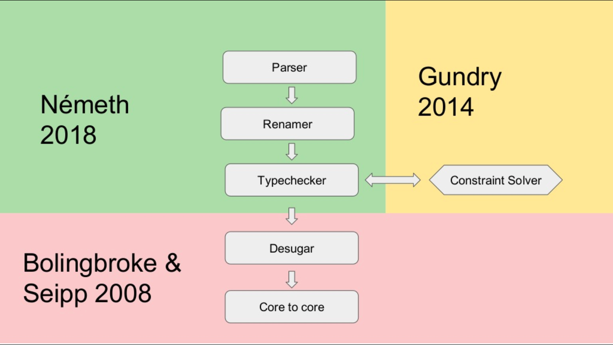
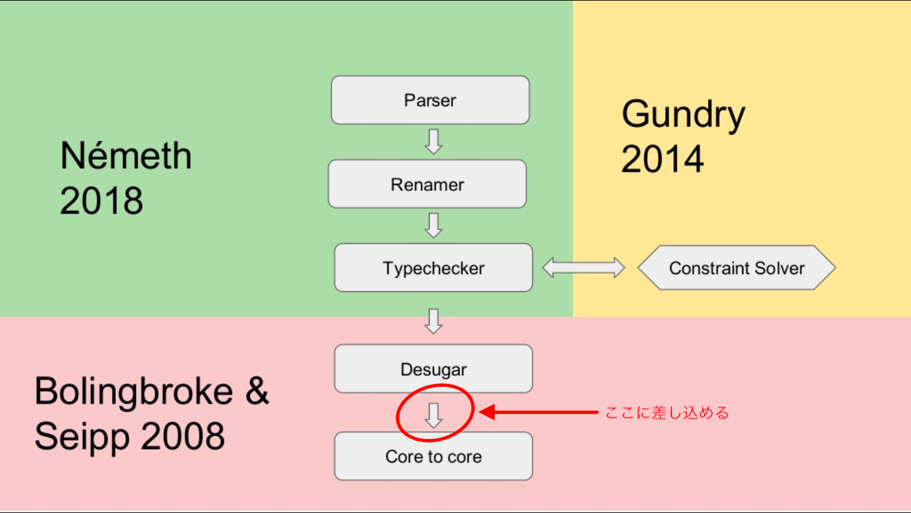
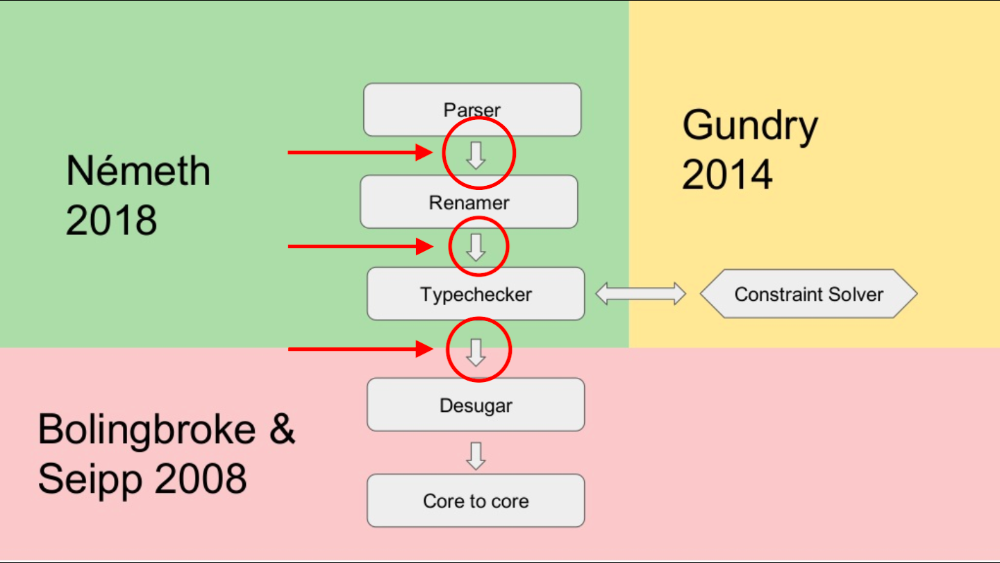

# GHC   Source   Plugin

---

## はじめに

+++

本資料は GHC に馴染みが無くても理解できるような構成になっています。

+++

GHC Source Plugin のおもしろさを伝えたい！

+++

どのぐらい面白いかと言うと...

+++

+++

---

## Source Plugin とは？

素晴らしい図があるので次のスライドを見てください。

+++

+++

完全に理解しましたね！！！

わかった人は挙手

---

### 古の Source Plugin

+++

図の赤色の領域が古から存在する Source Plugin

+++

つまり `Desugar → Core to core` の間に差し込むことができます。

+++

実際に作られた plugin もいくつかあります。

- [strict-ghc-plugin](http://hackage.haskell.org/package/strict-ghc-plugin)
- [cse-ghc-plugin](http://hackage.haskell.org/package/cse-ghc-plugin)

+++

当初はそこそこ期待したし これで Strict Haskell の時代到来か！とも思った

+++

しかし・・・

+++

びっくりするほど流行らなかった！！！

+++

### 理由 (たぶん)

- Source Plugin の情報が無さ過ぎ
- `darcs` が現役だったので・・・
- `Core` の知識が必要
- `Core to core` の最適化にしか使えなかった
- 当時は GHC API を使う人なんてほぼ居なかった (情報無さ過ぎ)

+++

### つまり

+++

時代が早すぎた・・・

+++

---

### New Source Plugin

+++

+++

図には載ってないけど、以下の場所にも差し込めます。

- spliceRunAction
- interfaceLoadAction

---

### 終わりに

+++

興味を持った人は、以下の資料を読めば完全に一人でプラグインを作れるようになります！

- [Source Plugins - ICFP 2018](https://icfp18.sigplan.org/event/hiw-2018-papers-source-plugins)
- [Source plugins - GHC User Manual](https://downloads.haskell.org/~ghc/latest/docs/html/users_guide/extending_ghc.html#source-plugins)
- [GHC Source Plugin 作ってみた - Qiita](https://qiita.com/waddlaw/items/65b57517f105fcbbe724)

---

### 作ってみよう! GHC SOURCE PLUGIN!!