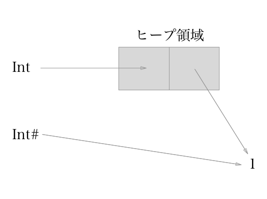
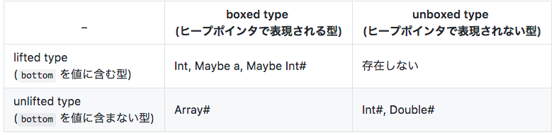

Levity Polymorphism

---

3分でわかった気になれる Levity Polymorphism 入門

+++

Question:

Levity って何？

+++

Levity Polymorphism の論文によると

> a name owing to its birth as an abstraction over only the levity (lifted vs. unlifted) of a type.

+++

levity とは型の lifted と unlifted にのみを対象とした抽象化のこと

+++

Question:

Levity Polymorphism って何？

+++

- lifted, unlifted に焦点をあてたポリモーフィズム
- メモリレイアウトの抽象化

+++

Question:

何ができるようになるの？

+++

Levity-polymorphic class (function) が定義できる

```haskell
{-# LANGUAGE MagicHash #-}
{-# LANGUAGE PolyKinds #-}
{-# LANGUAGE TypeInType #-}

import GHC.Prim (Int#, TYPE, (+#))
import GHC.Types (RuntimeRep, Int(I#))

class MyNum (a :: TYPE (r :: RuntimeRep)) where
  add :: a -> a -> a

instance MyNum Int where
  add = (+)

instance MyNum Int# where
  add = (+#)

main :: IO  ()
main = do
  print $ I# (add 1# 2#)
  print $ add (3 :: Int) 4
```

```
$ stack repl --resolver=ghc-8.2.1 levity.hs
*Main> main
3
7
```

---

注意

+++

ここから先は話題が多岐に渡ります

これでも概要しか説明していません

詳細は各自で補完してください

+++

- 今後のアップデートにより仕様が変更される場合があります

- 自分で検証する場合は GHC-7.10.3, GHC-8.0.2, GHC-8.2.1 の3種類を使うことをおすすめします

---

Recommended articles

- [About kind system of Haskell (Part 1)](https://haskell.jp/blog/posts/2017/10-about-kind-system-part1.html)
- [Haskellの種(kind)について (Part 2)](https://haskell.jp/blog/posts/2017/13-about-kind-system-part2.html)

---

lifted type と unlifted type

+++

 名前 | 意味
----|------
lifted type | bottom を値に含む型
unlifted type | bottom を値に含まない型

+++

このように、通常定義される代数的データ型には bottom が含まれます。

```
> :t undefined :: Bool
undefined :: Bool :: Bool

> :t True
True :: Bool

> :t False
False :: Bool
```

+++

Question:

型| lifted or unlifted
----|------
Bool | 
Bool# |
Int# | 
Maybe Int# |
Maybe Int |
Array# |

+++

Answer:

型| lifted or unlifted
----|------
Bool | lifted
Bool# | そんな型は存在しません。
Int# | unlifted
Maybe Int# | lifted
Maybe Int | lifted
Array# | unlifted

+++

ちょっと待ってください。

`Int#` って unboxed type じゃないんですか？

そもそも unlifted type と unboxed type って何が違うの？

---

boxed type と unboxed type

+++

 名前 | 意味
----|------
boxed type | ヒープポインタで表現される型
unboxed type | ヒープポインタで表現されない型

+++



+++

Question:

型| boxed or unboxed
----|------
Bool | 
Bool# |
Int# | 
Maybe Int# |
Maybe Int |
Array# |

+++

Answer:

型| boxed or unboxed
----|------
Bool | boxed
Bool# | 無いんだよ・・・
Int# | unboxed
Maybe Int# | boxed
Maybe Int | boxed
Array# | boxed

+++


---

(un)lifted type と (un)boxed type のまとめ

名前 | 意味
----|-----
lifted type | `bottom` を値に**含む**型 
unlifted type | `bottom` を値に**含まない**型
boxed type | ヒープポインタで表現**される**型
unboxed type | ヒープポインタで表現**されない**型

+++

具体例

```haskell
-- lifted boxed type
data Bool = False | True
data Either a b = Left a | Right b
data MyData = MyData Int
data Int = I# Int#

-- lifted unboxed type は存在しない

-- unlifted boxed type
data Array# = ...
data ByteArray# = ...

-- unlifted unboxed type
data Int# = ...
data Char# = ...
```

+++



---

MagicHash 言語拡張

+++


un(lifted | boxed) な世界に飛び込むためには

`MagicHash` 言語拡張が必要になります。

```haskell
-- MagicHash.hs
{-# LANGUAGE MagicHash #-}
import GHC.Prim ((+#))
import GHC.Types (Int(I#))
import GHC.CString (unpackCString#)

main = do
  putStrLn $ show $ I# (1# +# 5#)
  putStrLn $ show $ unpackCString# "foo"#
```

```
$ stack script MagicHash.hs --resolver ghc-8.2.1
Using resolver: ghc-8.2.1 specified on command line
6
"foo"
```

+++

unboxed value | unboxed type
------ | ------
'x'# | Char#
"foo"# | Addr#
3# | Int#
3## | Word#
3.2# | Float#
3.2## | Double#

---

Kinds (過去)

+++

基本カインド | 意味
-------|---------
* | lifted boxed types
# | unlifted types (unlifted boxed type, unlifted unboxed type)
Constraint | 型クラス制約
OpenKind | `*` と `#` のスーパーカインド
Box | カインドのための型。`* :: BOX`, `# :: BOX`, `BOX :: BOX`

+++

- 実は `*` と `#` は `OpenKind` のサブカインドとして実装されていた。
- さらにカインドのための `BOX` 型という型も存在していた

+++

OpenKind

+++

必要性 (その1)

(->) にカインドを与える

```haskell
(->) :: * -> * -> *
(->) :: # -> # -> *

-- 両方を扱うために
(->) :: OpenKind -> OpenKind -> *
```

- (->) は引数が全て満たされた状態でしか適用してはいけない

+++

必要性 (その2)

error と undefined に型を与える

```haskell
error :: forall (a :: OpenKind). String -> a
error Int# "foo" :: Int#
error Int "foo" :: Int

undefined :: forall (a :: OpenKind). a)
undefined :: Int#
undefined :: Int
```

+++

必要性 (その3)

推論時にラムダに束縛された変数にカインドを与える

```haskell
\x -> 3# +# x
```

- この時まだ x の型が lifted なのか unlifted なのかわからないため OpenKind を使う

+++

問題点

- OpenKind では myError s = error ("Blah" ++ s) のような関数を Int と Int# の両方に対して動作するようなカインド多相関数として定義することはできない。

+++

```haskell
{-# LANGUAGE MagicHash, ExplicitForAll, PolyKinds #-}

import GHC.Prim (Int#, (+#))
import GHC.Types (Int(I#))

liftedFunc :: Int -> Int -> Int
liftedFunc x y
  | x < y = x + y
  | otherwise = myError "x < y"

unliftedFunc :: Int# -> Int# -> Int#
unliftedFunc x y
  | (I# x) < (I# y) = x +# y
  | otherwise = myError "x < y"

myError :: String -> a
myError s = error ("Error: " ++ s)

main :: IO ()
main = do
  print $ liftedFunc 1 2
  print $ I# (unliftedFunc 1# 2#)
  print $ I# (unliftedFunc 2# 1#) -- error
  print $ liftedFunc 2 1 -- error
```

+++

```
$ stack script OpenKindProblem2.hs --resolver ghc-7.10.3
Using resolver: ghc-7.10.3 specified on command line

/home/bm12/repo/GHC8.2.1-survey/levity/code/OpenKindProblem2.hs:14:17:
    Couldn't match kind ‘*’ with ‘#’
    When matching types
      t0 :: *
      Int# :: #
    In the expression: myError "x < y"
    In an equation for ‘unliftedFunc’:
        unliftedFunc x y
          | (I# x) < (I# y) = x +# y
          | otherwise = myError "x < y"
```

- これが許可されない理由は myError :: String -> a の a が自動的に * カインドとして推論されてしまうから

+++

トップレベルに unlifted type な関数を定義した場合はエラーになる

```
Top-level bindings for unlifted types aren't allowed:
      unliftedValue = 0#
```

---

kinds (現在)

+++

基本カインド | 意味 | 備考
:-------:|---------|-----
Constraint | 型クラス制約 | 
Levity | Lifted, Unlifted | 実際の実装では RuntimeRep
TYPE | lifted type, unlifted type | RuntimeRep によって決まる

+++

- 色々と減ったおかげですっきりしました。
- 既存のカインドは `TYPE` を使って再定義できます。

+++

基本カインド | エイリアス
:-------:|--------
\* | type \* = TYPE Lifted
\#	 | type \# = TYPE Unlifted
OpenKind | type OpenKind = forall (l :: Levity). TYPE l
Box | type Box = TYPE Lifted

+++

Haskell で普通に定義されています。

```haskell
{-# LANGUAGE DataKinds #-}

data Levity = Lifted | Unlifted

data TYPE (a :: Levity) where
  TYPE :: a -> TYPE Lifted

type * = TYPE Lifted
type # = TYPE Unlifted
type OpenKind = forall (l :: Levity). TYPE l
```

+++

`OpenKind` では定義できなかった `myError` 関数

```haskell
-- OpenKindProblem.hs
{-# LANGUAGE MagicHash, ExplicitForAll, PolyKinds, TypeInType #-}

import GHC.Prim (Int#, (+#), TYPE)
import GHC.Types (Int(I#), RuntimeRep)

liftedFunc :: Int -> Int -> Int
liftedFunc x y
  | x < y = x + y
  | otherwise = myError "x < y"

unliftedFunc :: Int# -> Int# -> Int#
unliftedFunc x y
  | (I# x) < (I# y) = x +# y
  | otherwise = myError "x < y"

myError
  :: forall (l :: RuntimeRep) (a :: TYPE l).
     String -> a
myError s = error ("Error: " ++ s)

main :: IO ()
main = do
  print $ liftedFunc 1 2
  print $ I# (unliftedFunc 1# 2#)
  print $ I# (unliftedFunc 2# 1#) -- error
  print $ liftedFunc 2 1 -- error
```

+++

```
$ stack script OpenKindProblem.hs --resolver ghc-8.2.1
Using resolver: ghc-8.0.2 specified on command line
3
3
OpenKindProblem.hs: Error: x < y
CallStack (from HasCallStack):
  error, called at /home/bm12/repo/GHC8.2.1-survey/levity/code/OpenKindProblem.hs:19:13 in main:Main
```

---

DataKinds 言語拡張

+++

DataKinds 言語拡張を使うと

値が型へ、型がカインドへそれぞれ昇格します。

+++

```haskell
{-# LANGUAGE DataKinds #-}

data SimpleData a = SimpleData a
```

+++

分類 | 通常 | DataKinds
---- | ----- | ------
値 | SimpleData :: a -> SimpleData a | SimpleData :: a -> SimpleData a
型 | SimpleData :: \* -> \* <br> | SimpleData :: \* -> \* <br> 'SimpleData :: k -> SimpleData k
kind | | SimpleData :: \* -> \*

+++

- また、値が無い場合も定義できます。
- この場合はコンストラクタが被らないため<br>先頭の `'` が省略される。

+++

```haskell
{-# LANGUAGE DataKinds #-}

data SimpleData a
```

+++

分類 | 通常 | DataKinds
---- | ----- | ------
値 |  | 
型 | SimpleData :: \* -> \* | SimpleData :: \* -> \*
kind | | SimpleData :: \* -> \*

<br>

型とカインドは同じ名前空間を共有しているため<br>実際には `kind` の行は存在しません

---

カインドと型の推論順序

+++

カインド推論 → 型推論の順で行われます

+++

```haskell
-- About kind system of Haskell (Part 1) から引用
-- TestKind.hs

module TestKind where

f :: Maybe -> Int
f _ = 0

g :: Int -> Bool
g '0' = True
g _   = False
```

```
$ stack ghc -- -Wall TestKind.hs
[1 of 1] Compiling TestKind         ( TestKind.hs, TestKind.o )

TestKind.hs:5:6: error:
    • Expecting one more argument to ‘Maybe’
      Expected a type, but ‘Maybe’ has kind ‘* -> *’
    • In the type signature:
        f :: Maybe -> Int
```

---

Levity Polymorphism の目標

+++

以下のような関数をサポートしたい。

```haskell
\x -> x :: forall (v :: Levity) (a :: TYPE v). a -> a

myError :: forall (v :: Levity) (a :: TYPE v). String -> a
myError s = error ("Me" ++ s)
```

+++

確認

```haskell
-- v = Lifted
myError :: forall (v :: Levity) (a :: TYPE v). String -> a
myError :: forall (a :: TYPE Lifted). String -> a
myError :: forall (a :: *). String -> a
```

```haskell
-- v = Unlifted
myError :: forall (v :: Levity) (a :: TYPE v). String -> a
myError :: forall (a :: TYPE Unlifted). String -> a
myError :: forall (a :: #). String -> a
```

---

Levity Polymorphism 規則

+++

- ユーザは型シグネチャによって Levity Polymorphism を特別にリクエストできる

- Levity-polymorphic 型変数は**矢印の右側**にのみ出現することができる

```haskell
-- a は通常の型変数
-- b は Levity-polymorphic 型変数
good :: forall (v :: Levity) (a :: *) (b :: TYPE v). (a -> b) -> a -> b
good g x = g x
```

+++

具体例

```haskell
-- OK
(Int -> (ty :: TYPE v)) -> Int

-- NG
-- (ty :: TYPE v) -> Int で左側に出現するから
((ty :: TYPE v) -> Int) -> Int

-- OK
-- MkT :: (Int -> a) -> T v (a :: TYPE v)
data T v (a::TYPE v) = MkT (Int -> a)

-- OK
-- MkT :: (Int -> Int#) -> T Unlifted (Int# :: TYPE Unlifted)
MkT Unlifted Int# (\n -> error Unlifted Int# "urk")

-- OK
-- undefined :: forall v. forall (a :: TYPE v). a
undefined
```

---

この違いがわかるかな？

```haskell
good :: forall (v :: Levity) (a :: *) (b :: TYPE v). (a -> b) -> a -> b
good g x = g x

bad :: forall v. forall (a :: TYPE v). a -> a 
bad x = x
```

---

おまけ

+++

Levity ではなく RuntimeRep になった理由

+++

```haskell
type family Good a where
  Good Int# = Int
```

```haskell
type family Bad a :: k where
  Bad Int = Int#
  Bad Bool = Int
 
-- foo :: (Bad a :: TYPE r) -> ... と定義する

-- 以下のどちらも問題無い
-- foo :: (Bad a :: TYPE Lifted) -> ...
-- foo :: (Bad a :: TYPE Unifted) -> ...
```

+++

Int# と Int では、確保するメモリサイズが異なる！

↓

コンパイルできない!!

+++

Question:

仮に Bad a :: TYPE Unlifted だったらどうなる？

+++

Answer:

やっぱり、コンパイルできない！！！

+++

- unboxed type によってメモリサイズが異なるため、やはりダメ。
- Int# と Double# ではサイズ違うよね？

+++

解決策

+++

カインドから<br>値のメモリサイズがわかるようにすれば良い

```haskell
data RuntimeRep = PtrRepLifted | PtrRepUnlifted | IntRep | VoidRep | ...
TYPE :: RuntimeRep -> *
type * = TYPE 'PtrRepLifted
```

---

もっと知りたい人へ

+++

- [Levity Polymorphism (extended version)](https://cs.brynmawr.edu/~rae/papers/2017/levity/levity.pdf)
 - Levity Polymorphism の論文 (理論的な正しさについて証明等まで事細かに記載してある)

- [NoSubKinds](https://ghc.haskell.org/trac/ghc/wiki/NoSubKinds)
 - Kind の時系列的な流れを知る際にとても役立つ

---

全ては DependentHaskell へ向けて・・・
