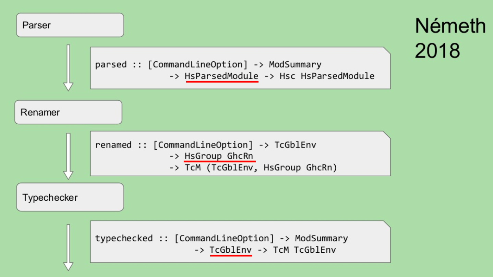

# GHC <br> Source <br> Plugin

---

## はじめに

+++

本資料は GHC に馴染みが無くても理解できるような構成になっています。

+++

GHC Source Plugin のおもしろさを伝えたい！

+++

どのぐらい面白いかと言うと...

+++


+++


---

## Source Plugin とは？

素晴らしい図があるので次のスライドを見てください。

+++


+++

完全に理解しましたね！！！

わかった人は挙手

---

### 古の Source Plugin

+++


図の赤色の領域が古から存在する Source Plugin

+++

つまり `Desugar → Core to core` の間に差し込むことができます。

+++

実際に作られた plugin もいくつかあります。

- [strict-ghc-plugin](http://hackage.haskell.org/package/strict-ghc-plugin)
- [cse-ghc-plugin](http://hackage.haskell.org/package/cse-ghc-plugin)

+++

当初はそこそこ期待したし<br>これで Strict Haskell の時代到来か！とも思った

+++

しかし・・・

+++


びっくりするほど流行らなかった！！！

+++

### 理由 (たぶん)

- Source Plugin の情報が無さ過ぎ
- `darcs` が現役だったので・・・
- `Core` の知識が必要
- `Core to core` の最適化にしか使えなかった
- 当時は GHC API を使う人なんてほぼ居なかった (情報無さ過ぎ)

+++

### つまり

+++

時代が早すぎた・・・

+++


---

### New Source Plugin

+++


+++

図には載ってないけど<br>以下の場所にも差し込めます。

- spliceRunAction
- interfaceLoadAction

+++

緑の領域に注目してみましょう

+++



+++

#### プラグイン作成のコツ

- 作ってみてわかりましたが、型が合えばだいたい動きます
- [GHC Source Code Abbreviations](https://ghc.haskell.org/trac/ghc/wiki/Commentary/Abbreviations) を把握しておくとコードリーディングがはかどります
- [haskell-code-explorer](https://haskell-code-explorer.mfix.io/package/ghc-8.4.3) が使えたら良いんだけど、8.6 系のドキュメント無い・・・
- [ghc package - Stackage](https://www.stackage.org/nightly-2018-12-06/package/ghc-8.6.2) で関数名を検索すると結構良い感じに理解できる
- GHC API は ghc のバージョンが変わるとだいぶ内容が変わるので、古いドキュメントを参照していないか注意

---

## 作ってみた

+++

全部で6つ作りました

---

### [No.1 Basic](https://github.com/waddlaw/GHC-survey/blob/master/ghc-8.6.1-8.8.1/Source-Plugin/code/basic/BasicPlugin.hs)

+++

GHC のマニュアルに載っている例を動くようにしました。

+++

#### ソースコード

```haskell
module BasicPlugin (plugin) where

import Control.Monad.IO.Class
import DynFlags (getDynFlags)
import Plugins
import HscTypes
import TcRnTypes
import HsExtension
import HsDecls
import HsExpr
import HsImpExp
import Avail
import Outputable
import HsDoc

plugin :: Plugin
plugin = defaultPlugin
  { parsedResultAction = parsedPlugin
  , renamedResultAction = renamedAction
  , typeCheckResultAction = typecheckPlugin
  , spliceRunAction = metaPlugin
  , interfaceLoadAction = interfaceLoadPlugin
  }

parsedPlugin :: [CommandLineOption] -> ModSummary -> HsParsedModule -> Hsc HsParsedModule
parsedPlugin _ _ pm = do
  dflags <- getDynFlags
  liftIO $ putStrLn $ "parsePlugin: \n" ++ (showSDoc dflags $ ppr $ hpm_module pm)
  return pm

renamedAction :: [CommandLineOption] -> TcGblEnv -> HsGroup GhcRn -> TcM (TcGblEnv, HsGroup GhcRn)
renamedAction _ tc gr = do
  dflags <- getDynFlags
  liftIO $ putStrLn $ "typeCheckPlugin (rn): " ++ (showSDoc dflags $ ppr gr)
  return (tc, gr)

typecheckPlugin :: [CommandLineOption] -> ModSummary -> TcGblEnv -> TcM TcGblEnv
typecheckPlugin _ _ tc = do
  dflags <- getDynFlags
  liftIO $ putStrLn $ "typeCheckPlugin (rn): \n" ++ (showSDoc dflags $ ppr $ tcg_rn_decls tc)
  liftIO $ putStrLn $ "typeCheckPlugin (tc): \n" ++ (showSDoc dflags $ ppr $ tcg_binds tc)
  return tc

metaPlugin :: [CommandLineOption] -> LHsExpr GhcTc -> TcM (LHsExpr GhcTc)
metaPlugin _ meta = do
  dflags <- getDynFlags
  liftIO $ putStrLn $ "meta: " ++ (showSDoc dflags $ ppr meta)
  return meta

interfaceLoadPlugin :: [CommandLineOption] -> ModIface -> IfM lcl ModIface
interfaceLoadPlugin _ iface = do
  dflags <- getDynFlags
  liftIO $ putStrLn $ "interface loaded: " ++ (showSDoc dflags $ ppr $ mi_module iface)
  return iface
```

+++

#### 実行結果

```haskell
parsePlugin:
module Example where
a = ()
$(return [])
typeCheckPlugin (rn): a = ()
interface loaded: Language.Haskell.TH.Lib.Internal
meta: return []
typeCheckPlugin (rn):
typeCheckPlugin (rn):
Nothing
typeCheckPlugin (tc):
{$trModule
   = Module (TrNameS "basic-0.1.0.0-inplace"#) (TrNameS "Example"#),
 a = ()}
```

---

### [No.2 Basic Refine](https://github.com/waddlaw/GHC-survey/blob/master/ghc-8.6.1-8.8.1/Source-Plugin/code/basic-simple/BasicPluginSimple.hs)

+++

GHC のマニュアルの例を良い感じにリファインしました。

動作は同じです。

+++

#### ソースコード

```haskell
module BasicPluginSimple (plugin) where

import GhcPlugins
import TcRnTypes (IfM, TcM, TcGblEnv, tcg_binds, tcg_rn_decls)
import HsExtension (GhcTc, GhcRn)
import HsDecls (HsGroup)
import HsExpr (LHsExpr)

plugin :: Plugin
plugin = defaultPlugin
  { parsedResultAction = parsedPlugin
  , renamedResultAction = renamedAction
  , typeCheckResultAction = typecheckPlugin
  , spliceRunAction = metaPlugin
  , interfaceLoadAction = interfaceLoadPlugin
  }

parsedPlugin :: [CommandLineOption] -> ModSummary -> HsParsedModule -> Hsc HsParsedModule
parsedPlugin _ _ pm = do
  dflags <- getDynFlags
  liftIO $ putStrLn $ "parsePlugin: \n" ++ (showSDoc dflags $ ppr $ hpm_module pm)
  return pm

renamedAction :: [CommandLineOption] -> TcGblEnv -> HsGroup GhcRn -> TcM (TcGblEnv, HsGroup GhcRn)
renamedAction _ tc gr = do
  dflags <- getDynFlags
  liftIO $ putStrLn $ "typeCheckPlugin (rn): " ++ (showSDoc dflags $ ppr gr)
  return (tc, gr)

typecheckPlugin :: [CommandLineOption] -> ModSummary -> TcGblEnv -> TcM TcGblEnv
typecheckPlugin _ _ tc = do
  dflags <- getDynFlags
  liftIO $ putStrLn $ "typeCheckPlugin (rn): \n" ++ (showSDoc dflags $ ppr $ tcg_rn_decls tc)
  liftIO $ putStrLn $ "typeCheckPlugin (tc): \n" ++ (showSDoc dflags $ ppr $ tcg_binds tc)
  return tc

metaPlugin :: [CommandLineOption] -> LHsExpr GhcTc -> TcM (LHsExpr GhcTc)
metaPlugin _ meta = do
  dflags <- getDynFlags
  liftIO $ putStrLn $ "meta: " ++ (showSDoc dflags $ ppr meta)
  return meta

interfaceLoadPlugin :: [CommandLineOption] -> ModIface -> IfM lcl ModIface
interfaceLoadPlugin _ iface = do
  dflags <- getDynFlags
  liftIO $ putStrLn $ "interface loaded: " ++ (showSDoc dflags $ ppr $ mi_module iface)
  return iface
```

+++

#### 実行結果

```haskell
parsePlugin:
module Example where
a = ()
$(return [])
typeCheckPlugin (rn): a = ()
interface loaded: Language.Haskell.TH.Lib.Internal
interface loaded: Language.Haskell.TH.Syntax
meta: return []
typeCheckPlugin (rn):
typeCheckPlugin (rn):
Nothing
typeCheckPlugin (tc):
{$trModule
   = Module
       (TrNameS "basic-simple-0.1.0.0-inplace"#) (TrNameS "Example"#),
 a = ()}
```

---

### [No.3 Add Decl](https://github.com/waddlaw/GHC-survey/blob/master/ghc-8.6.1-8.8.1/Source-Plugin/code/add-decl/AddDecl.hs)

+++

プラグインで作った関数をモジュールに定義し<br>
モジュール内で利用できる

+++

#### ソースコード

```haskell
module AddDecl (plugin) where

import GhcPlugins
import TcRnTypes (IfM, TcM, TcGblEnv, tcg_binds, tcg_rn_decls)
import HsExtension (GhcTc, GhcRn, GhcPs)
import HsDecls (HsGroup)
import HsExpr (LHsExpr)
import HsSyn (HsModule, hsmodDecls)
import Parser (parseDeclaration)
import Lexer (unP, ParseResult(POk), mkPState)
import HsDecls (LHsDecl)
import StringBuffer (stringToStringBuffer)

plugin :: Plugin
plugin = defaultPlugin
  { parsedResultAction = parsedPlugin
  }

parsedPlugin :: [CommandLineOption] -> ModSummary -> HsParsedModule -> Hsc HsParsedModule
parsedPlugin _ _ pm = do
  dflags <- getDynFlags

  let f = hsmodDecls . unLoc
      g = parserDecl "g = 1+1" dflags

      m = fmap (updateHsModule g) $ hpm_module pm
      pm' = pm { hpm_module = m }

  liftIO $ putStrLn $ "parsePlugin: \n" ++ (showSDoc dflags $ ppr $ f $ hpm_module pm')
  return pm'

parserDecl :: String -> DynFlags -> LHsDecl GhcPs
parserDecl str dflags =
  case unP parseDeclaration (mkPState dflags buf loc) of
    POk _ rdr_module -> rdr_module
    _ -> undefined
  where
    loc = mkRealSrcLoc (mkFastString "plugin") 1 1
    buf = stringToStringBuffer str

updateHsModule :: LHsDecl pass -> HsModule pass -> HsModule pass
updateHsModule decl hsm = hsm { hsmodDecls = decl:decls }
  where decls = hsmodDecls hsm
```

+++

#### プラグイン利用側のコード

```haskell
{-# OPTIONS_GHC -fplugin AddDecl #-}
module Example where

b :: Int
b = g + 2
```

+++

#### 実行結果

```haskell
ghci> :t g
g :: Int
ghci> g
2
ghci> b
4
```

---

### [No.3 Add Decl](https://github.com/waddlaw/GHC-survey/blob/master/ghc-8.6.1-8.8.1/Source-Plugin/code/add-decl/AddDecl.hs)

+++

プラグインで作った関数をモジュールに定義し、モジュール内で利用できる

+++

#### ソースコード

+++

#### 実行結果

---

### 終わりに

+++

興味を持った人は、以下の資料を読めば完全に一人でプラグインを作れるようになります！

- [Source Plugins - ICFP 2018](https://icfp18.sigplan.org/event/hiw-2018-papers-source-plugins)
- [Source plugins - GHC User Manual](https://downloads.haskell.org/~ghc/latest/docs/html/users_guide/extending_ghc.html#source-plugins)
- [GHC Source Plugin 作ってみた - Qiita](https://qiita.com/waddlaw/items/65b57517f105fcbbe724)

---

### 作ってみよう!<br>GHC SOURCE PLUGIN!!